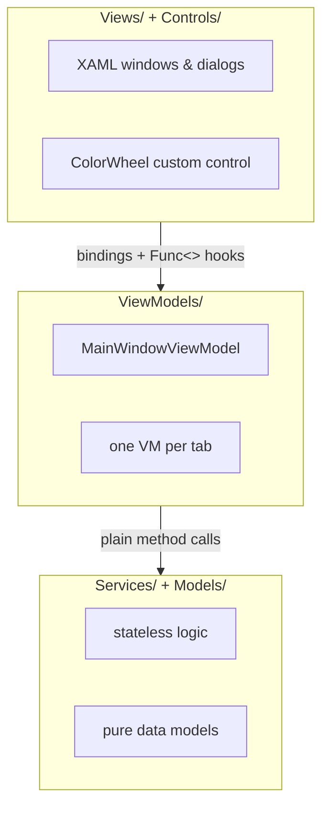

# 01 — Overview

> What the app is, the stack it's built on, and the layering rules that keep it maintainable.

Related: [[Home]] · [[02-Bootstrap-and-Composition-Root]] · [[03-Services-Layer]] · [[Glossary]]

## What it does

Omarchy Theme Creator is a desktop GUI for authoring [Omarchy](https://omarchy.org) themes. An
Omarchy theme is a folder of colors, an optional icon pack, wallpapers, and a preview image. The
app lets you:

- Edit the 22-key color palette by hand, with a live preview and undo/redo.
- Generate a palette automatically from a wallpaper (see [[07-Palette-Extraction]]).
- Apply built-in presets (Dracula, Nord, Gruvbox, Catppuccin…) or import Base16 schemes.
- Check color pairs against WCAG contrast thresholds.
- Search/download wallpapers from wallhaven.cc and apply raster filters (see [[08-Wallpaper-Tools]]).
- Apply the theme to the live desktop (when the `omarchy` CLI is present) and export it as a
  distributable git repo.

A defining constraint: the app must work as a **pure editor** with no `omarchy-*` tools on `PATH`.
Every integration with the desktop degrades gracefully — see [[09-Live-Theming-and-Self-Sync]].

## Tech stack

| Concern | Choice | Notes |
|---|---|---|
| Runtime | **.NET 10** (`net10.0`) | `Nullable` enabled, `LangVersion=latest` |
| UI framework | **Avalonia 11.2.3** | Cross-platform XAML; Fluent theme + Inter font |
| MVVM | **CommunityToolkit.Mvvm 8.4.0** | Source-generated `[ObservableProperty]` / `[RelayCommand]` |
| Imaging | **SkiaSharp 2.88.9** | Decode, quantize, filter, encode |
| Logging | **Serilog 4.4.0** (+ Console/File sinks) | Static facade, no DI — see [[12-Logging-and-Diagnostics]] |
| Distribution | single-file self-contained `linux-x64` | see [[13-Build-and-Packaging]] |

The `AssemblyName` is `omarchy-theme-creator`; the `RootNamespace` is `OmarchyThemeCreator`.

## The three layers

**`Services/`** — Stateless logic with **no Avalonia/UI dependencies**: theme I/O, palette
extraction, the wallhaven client, SkiaSharp image editing, the omarchy CLI wrapper. *Prefer
putting new logic here.* Detailed in [[03-Services-Layer]].

**`ViewModels/`** — CommunityToolkit.Mvvm view-models. One VM per tab, all owned by
`MainWindowViewModel`. Detailed in [[04-ViewModels-and-MVVM]].

**`Views/`** — Avalonia XAML. `MainWindow.axaml.cs` wires View-only capabilities (file pickers,
dialogs) onto the VM via `Func<>` hook properties. Detailed in [[05-Views-and-Dialogs]].

**`Models/`** — Pure data types shared by all layers: `ThemeColors`, `Theme`, `WallpaperFilter`,
and the `ColorMath` utility. Covered in [[10-Theme-Persistence]] and [[07-Palette-Extraction]].

### App-root files (deliberately touch Avalonia, so they sit above `Services/`)

- `Program.cs`, `App.axaml(.cs)` — entry point + composition root ([[02-Bootstrap-and-Composition-Root]]).
- `AppThemeSync.cs` — maps a palette onto the app's own chrome ([[09-Live-Theming-and-Self-Sync]]).
- `AppLog.cs` — Serilog bootstrap ([[12-Logging-and-Diagnostics]]).
- `Converters.cs` — XAML `IValueConverter`s ([[05-Views-and-Dialogs]]).

## Key invariants (don't break these)

1. **One palette choke point.** Every color change goes through
   [[06-Palette-Flow-and-IPaletteHost|IPaletteHost.ApplyPalette]]. This keeps the preview, undo/redo,
   and contrast panel in sync. Don't mutate the palette around it.
2. **Graceful degradation.** `OmarchyCliService.IsAvailable`, `ScreenColorPicker.IsAvailable`,
   `LiveOmarchyThemeService.IsAvailable` all report absence rather than throwing; the UI hides or
   disables the corresponding feature.
3. **User dir is the only writable theme dir.** `ThemeRepository` never writes to the system
   (built-in) theme directory. See [[10-Theme-Persistence]].
4. **Services stay UI-free.** Anything that needs Avalonia lives in a ViewModel, a View, or an
   app-root file — never in `Services/`.

## Avalonia 11.2 gotchas

- `Grid` has **no** `RowSpacing`/`ColumnSpacing` in this version — use per-child `Margin`
  (`StackPanel.Spacing`/`WrapPanel` are fine).
- Compiled bindings are on by default (`AvaloniaUseCompiledBindingsByDefault=true`), but
  `MainWindow.axaml` sets `x:CompileBindings="False"`, so its bindings resolve at runtime.
