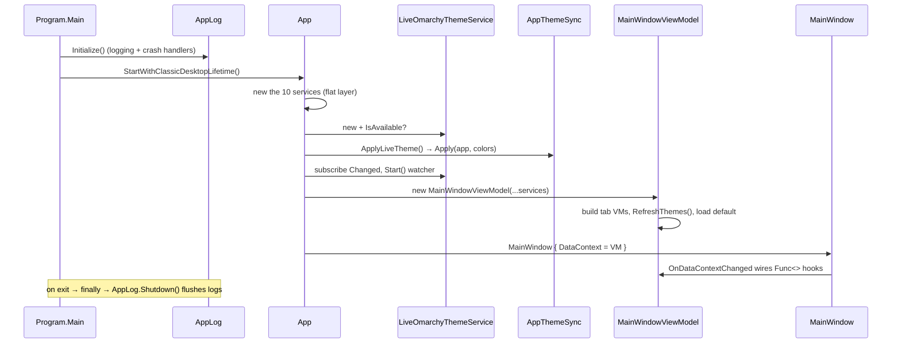

# 02 — Bootstrap & Composition Root

> How the app starts and where the entire object graph is assembled — by hand, no DI container.

Related: [[Home]] · [[01-Overview]] · [[04-ViewModels-and-MVVM]] · [[09-Live-Theming-and-Self-Sync]] · [[12-Logging-and-Diagnostics]]

## Entry point — `Program.cs`

`Main` is deliberately tiny. It initializes logging **first** (before any Avalonia code), runs the
classic desktop lifetime, and guarantees logs are flushed even on a hard crash via `finally`.

```csharp
[STAThread]
public static void Main(string[] args)
{
    AppLog.Initialize();
    try
    {
        BuildAvaloniaApp().StartWithClassicDesktopLifetime(args);
    }
    catch (Exception ex)
    {
        // Anything that escapes the Avalonia run loop lands here; record it before we die.
        Log.Fatal(ex, "Fatal error; application is terminating.");
        throw;
    }
    finally
    {
        AppLog.Shutdown();
    }
}

public static AppBuilder BuildAvaloniaApp()
    => AppBuilder.Configure<App>()
        .UsePlatformDetect()   // auto-detect X11/Wayland
        .WithInterFont()       // bundle the Inter font
        .LogToTrace();
```

> **Why `AppLog.Initialize()` before Avalonia?** So that even failures during framework startup are
> captured. `AppLog` also installs process-wide crash handlers — see [[12-Logging-and-Diagnostics]].

## Composition root — `App.axaml.cs`

`OnFrameworkInitializationCompleted` is the single place the whole graph is built. There is **no DI
container**: services are `new`-ed in order, then passed positionally into `MainWindowViewModel`.

```csharp
public override void OnFrameworkInitializationCompleted()
{
    if (ApplicationLifetime is IClassicDesktopStyleApplicationLifetime desktop)
    {
        ThemeRepository repository = new ThemeRepository();
        OmarchyCliService cli = new OmarchyCliService();
        IconThemeService icons = new IconThemeService();
        ExportService export = new ExportService();
        PaletteExtractionService extractor = new PaletteExtractionService();
        PresetService presets = new PresetService();
        WallhavenService wallhaven = new WallhavenService();
        WallpaperColorAnalyzer colorAnalyzer = new WallpaperColorAnalyzer();
        ImageEditService imageEditor = new ImageEditService();
        SettingsService settings = new SettingsService();

        // Match the app's own chrome to the live Omarchy desktop theme, and keep tracking it.
        _liveTheme = new LiveOmarchyThemeService();
        Log.Information("Live Omarchy theme {Availability}",
            _liveTheme.IsAvailable ? "detected" : "not present");
        ApplyLiveTheme();
        _liveTheme.Changed += (_, _) => Dispatcher.UIThread.Post(ApplyLiveTheme);
        _liveTheme.Start();

        desktop.MainWindow = new MainWindow
        {
            DataContext = new MainWindowViewModel(
                repository, cli, icons, export,
                extractor, presets, wallhaven, colorAnalyzer, imageEditor, settings)
        };

        desktop.Exit += (_, _) => _liveTheme?.Dispose();
    }

    base.OnFrameworkInitializationCompleted();
}
```

### Notes on the wiring

- The ten services in the first block have **no dependencies on each other at construction** — it's
  a flat layer. Cross-service collaboration happens later, by method call, orchestrated from the VMs.
- `_liveTheme` is stored in a **field** (not a local) so its `FileSystemWatcher` survives for the
  app's lifetime; it's disposed on `desktop.Exit`. It's the one service kept as app state, because
  it drives self-theming ([[09-Live-Theming-and-Self-Sync]]).
- `Dispatcher.UIThread.Post(ApplyLiveTheme)` marshals the file-watcher callback (which fires on a
  thread-pool thread) back onto the UI thread before touching Avalonia resources.

### Sub-view-model construction

`MainWindowViewModel` receives the services and, in its constructor, builds the per-tab VMs, handing
each the services it needs plus `this` as their [[06-Palette-Flow-and-IPaletteHost|IPaletteHost]]:

```csharp
Extract = new ExtractViewModel(extractor, this);
Presets = new PresetsViewModel(presets, this);
Wallpaper = new WallpaperViewModel(wallhaven, colorAnalyzer, imageEditor, settings, this,
                                   path => Extract.LoadWallpaper(path));
CurrentWallpapers = new CurrentWallpapersViewModel(_repo, imageEditor, this);
```

See [[04-ViewModels-and-MVVM]] for the ownership graph.

## Startup sequence



## Why hand-wiring instead of a DI container?

The service graph is small, flat, and fully known at startup. Hand-wiring keeps the whole
composition legible in one method, avoids a container dependency, and pairs naturally with the
static Serilog facade (each class grabs `Log.ForContext<T>()` rather than receiving an injected
logger). If the graph ever grows lifetimes or conditional registration, revisit this — but today the
explicit version is the simplest thing that works.
