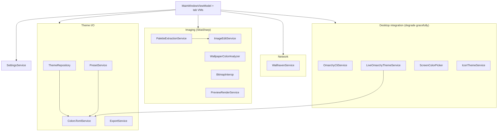

# 03 — Services Layer

> The stateless logic layer. No Avalonia. New logic goes here by default.

Related: [[Home]] · [[01-Overview]] · [[02-Bootstrap-and-Composition-Root]] · [[10-Theme-Persistence]] · [[07-Palette-Extraction]] · [[08-Wallpaper-Tools]] · [[09-Live-Theming-and-Self-Sync]]

Everything under `Services/` is UI-free business logic. Services are constructed once in the
[[02-Bootstrap-and-Composition-Root|composition root]] and collaborate only through the
view-models. Two conventions run through the whole layer:

- **Graceful degradation** — anything that shells out or touches the desktop reports absence via an
  `IsAvailable` flag (or returns `null`) instead of throwing, so the app still runs as a pure editor.
- **Stateless where possible** — most services hold no mutable state; the two that cache
  ([[07-Palette-Extraction|PaletteExtractionService]]'s single-entry swatch cache) are documented as
  UI-thread-only.

## The service map

## Index

Each row links to the note that covers it in depth; a few small helpers are described fully here.

| Service | Purpose | Deep dive |
|---|---|---|
| `ThemeRepository` | Discover/load/save/clone themes; manage `backgrounds/` and `preview.png`. Writes only to the user dir. | [[10-Theme-Persistence]] |
| `ColorsTomlService` | Tolerant parse + canonical serialize of `colors.toml`. | [[10-Theme-Persistence]] |
| `ExportService` | Scaffold a distributable git repo (README, MIT LICENSE, `git init`). | below |
| `PresetService` | Built-in schemes + Base16 `.yaml` import (no YAML lib). | below |
| `PaletteExtractionService` | Wallpaper → 22-key palette (median-cut + modes + WCAG). | [[07-Palette-Extraction]] |
| `ImageEditService` | SkiaSharp adjustments/filters + named presets. | [[08-Wallpaper-Tools]] |
| `WallpaperColorAnalyzer` | Thumbnail color histogram + theme-match scoring (stateless, thread-safe). | [[08-Wallpaper-Tools]] |
| `WallhavenService` | wallhaven.cc search/download client. | [[08-Wallpaper-Tools]] |
| `BitmapInterop` | Move images between SkiaSharp and Avalonia. | below |
| `PreviewRenderService` | Rasterize an Avalonia control to `preview.png`. | below |
| `OmarchyCliService` | Wrap `omarchy-theme-set`; `IsAvailable` when on `PATH`. | [[09-Live-Theming-and-Self-Sync]] |
| `LiveOmarchyThemeService` | Track the *applied* desktop theme; raise `Changed`. | [[09-Live-Theming-and-Self-Sync]] |
| `IScreenColorPicker` / `ScreenColorPicker` | Eyedropper via `hyprpicker`. | [[11-Color-Picker-and-ColorWheel]] |
| `IconThemeService` | Discover installed icon themes; find an example icon. | below |
| `SettingsService` | App preferences (Wallhaven API key) in `settings.json`. | below |

## Smaller services, in full

### `SettingsService`
Loads/saves app-level preferences to `~/.config/omarchy-theme-creator/settings.json`. `AppSettings`
currently holds just `WallhavenApiKey`. Malformed/missing files degrade to defaults. Consumed by
[[08-Wallpaper-Tools|WallpaperViewModel]] to gate NSFW searches.

### `IconThemeService`
Enumerates installed icon themes from `/usr/share/icons` (and `/usr/local/...`), surfacing `Yaru`
variants first (Omarchy convention). `FindExampleIcon(themeName)` returns a representative PNG (a
folder icon if possible) for the little preview swatch — returns `null` for SVG-only themes since
there's no SVG rasterizer wired in.

### `ExportService`
`Export(theme, targetParentDir)` copies the theme folder to `omarchy-<name>-theme/`, writes a
generated `README.md` + MIT `LICENSE`, and best-effort runs `git init/add/commit`. Returns an
`ExportResult(RepoPath, GitInitialized, InstallCommand)`. Git failure is non-fatal (the files are
still exported).

### `PresetService`
Ships `NamedPalette` records for well-known schemes (Dracula, Nord, Gruvbox, Catppuccin, …) and
`ImportBase16(path)` to map a Base16 `.yaml` scheme onto Omarchy's 22 keys. Parsing is deliberately
tolerant (regex-free hex extraction), mirroring `ColorsTomlService`. See [[Glossary#Base16]].

### `BitmapInterop`
Static helpers bridging SkiaSharp and Avalonia:
- `TryLoad(path)` / `TryLoadThumbnail(path, width)` → Avalonia `Bitmap?` (thumbnail decodes straight
  to the target width for grid performance).
- `ToAvalonia(SKBitmap)` → encodes to PNG in memory and wraps as an Avalonia `Bitmap` (used to show
  SkiaSharp-edited images in the UI).

### `PreviewRenderService`
`RenderPng(control, outputPath, scale)` rasterizes any Avalonia `Control` to a PNG via
`RenderTargetBitmap`. Used by `GeneratePreview` to snapshot the live preview panel into the theme's
`preview.png` (Omarchy shows that in its theme switcher).
