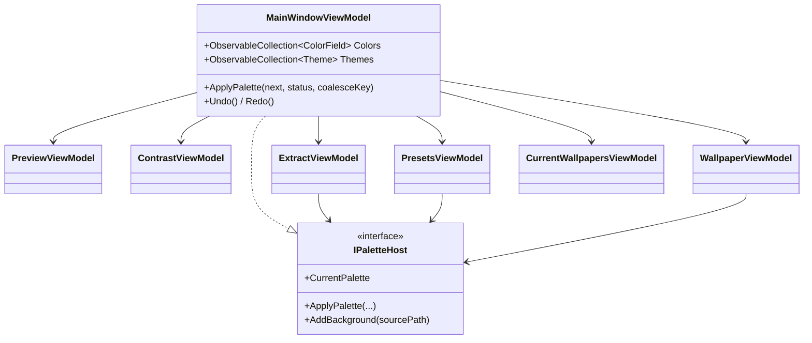

# 04 — ViewModels & MVVM

> How the MVVM Toolkit is used, and how `MainWindowViewModel` owns and mediates every tab.

Related: [[Home]] · [[05-Views-and-Dialogs]] · [[06-Palette-Flow-and-IPaletteHost]] · [[07-Palette-Extraction]] · [[08-Wallpaper-Tools]] · [[11-Color-Picker-and-ColorWheel]]

## MVVM Toolkit primer (why the VMs look magic)

The VMs use **CommunityToolkit.Mvvm**, a source generator. You write a `partial class` with private
fields and it generates the public observable properties and command wrappers at compile time.

```csharp
[ObservableProperty] private string _statusText = "Ready.";
// generates: public string StatusText { get; set; } with INotifyPropertyChanged + OnStatusTextChanged hooks

[RelayCommand]
private void NewTheme() { ... }
// generates: public IRelayCommand NewThemeCommand { get; }
```

Two generated features the codebase leans on heavily:

- **`partial void OnXChanged(T value)`** — an optional hook the generator calls from the property
  setter. The Extract tab uses these to auto-re-extract when a slider moves:
  ```csharp
  partial void OnVibranceChanged(double value) => Extract();
  ```
- **`[NotifyCanExecuteChangedFor(nameof(SomeCommand))]`** — re-queries a command's `CanExecute` when
  the property changes (e.g. enabling *Delete* only when a user theme is selected).

### The `_suppress` reentrancy pattern

Several VMs expose the *same* value two ways (hex text **and** an Avalonia `Color`, or HSV **and**
RGB). Editing one updates the other, which would fire *its* change handler and loop forever. A
private `bool _suppress` flag breaks the cycle. From `ColorField`:

```csharp
partial void OnHexChanged(string value)
{
    if (_suppress) return;
    string? norm = ThemeColors.NormalizeHex(value);
    IsValid = norm is not null;
    if (norm is null) return;

    _suppress = true;
    Color = ParseColor(norm);   // updates Color WITHOUT re-entering via OnColorChanged
    _suppress = false;
    _onChanged(this);           // notify the parent editor once
}
```

The same guard appears in [[11-Color-Picker-and-ColorWheel|ColorPickerViewModel]] and the
`ColorWheel` control. Whenever you mirror a value across representations, reach for this pattern.

## Ownership graph

`MainWindowViewModel` is the root. It implements [[06-Palette-Flow-and-IPaletteHost|IPaletteHost]]
and constructs every tab VM, passing itself in as the host.



### Why tabs talk to an interface, not the concrete VM

Each tab holds an `IPaletteHost`, not a `MainWindowViewModel`. That keeps a tab focused on its own
job and gives it exactly one sanctioned way to change shared state (`ApplyPalette`). It also means a
tab VM could be unit-tested against a fake host with no window. This is the crux of the design —
see [[06-Palette-Flow-and-IPaletteHost]].

## The view-models

### `MainWindowViewModel` (root / mediator)
Owns the working palette (`_working : ThemeColors`), the loaded `Theme` (`_current`, which carries
the on-disk `Path` for asset ops), the theme list, the editable `ColorField` collection, undo/redo
history, and the `Func<>` view hooks. Its commands are the top-level actions: `NewTheme`,
`OpenSelected`, `CloneSelected`, `DeleteSelected`, `Save`, `Apply`, `AddBackgrounds`,
`GeneratePreview`, `SetPreviewImage`, `Export`, `Undo`, `Redo`, `EditColor`. Undo/redo and
`ApplyPalette` are detailed in [[06-Palette-Flow-and-IPaletteHost]].

### `PreviewViewModel`
Derives Avalonia `IBrush`es (background, foreground, accent, cursor, selection, plus 16 ANSI
brushes) from a `ThemeColors`. `Update(colors)` recomputes them; called from `ApplyPalette`. This is
what the live preview panel binds to.

### `ContrastViewModel`
Holds `ContrastRow`s for the key pairings (FG/BG, selection, accent/BG, cursor/BG). `Update(colors)`
recomputes each via `ColorMath.ContrastRatio` + `ColorMath.Grade` (see [[07-Palette-Extraction]] for
`ColorMath`).

### `ExtractViewModel`
Wallpaper → palette. Mode + slider properties each have an `OnXChanged` hook that calls `Extract()`,
which runs [[07-Palette-Extraction|PaletteExtractionService]] and pushes the result via
`ApplyPalette` with a `coalesceKey` so a slider drag folds into one undo step:
```csharp
_host.ApplyPalette(colors, $"Extracted palette from {name}.",
                   coalesceKey: "extract:" + WallpaperPath);
```

### `PresetsViewModel`
Apply a built-in `NamedPalette` or import a Base16 file, both landing through `ApplyPalette`.

### `WallpaperViewModel`
The biggest tab: wallhaven search + background color analysis + an embedded SkiaSharp image editor.
Covered in [[08-Wallpaper-Tools]].

### `CurrentWallpapersViewModel`
Manages the backgrounds of the *open* theme (rename/reorder/remove/edit/preview). Its
`Items : ObservableCollection<WallpaperItem>` is the **single source of truth** for the theme's
background list — the main VM reads from it when saving.

### `ColorField` / `ColorPickerViewModel` / `WallpaperItem` / `ImageEditorViewModel`
Leaf VMs. `ColorField` is one palette entry (hex ⇄ Color, above). `ColorPickerViewModel` and
`ImageEditorViewModel` back the modal dialogs — see [[11-Color-Picker-and-ColorWheel]] and
[[08-Wallpaper-Tools]].
