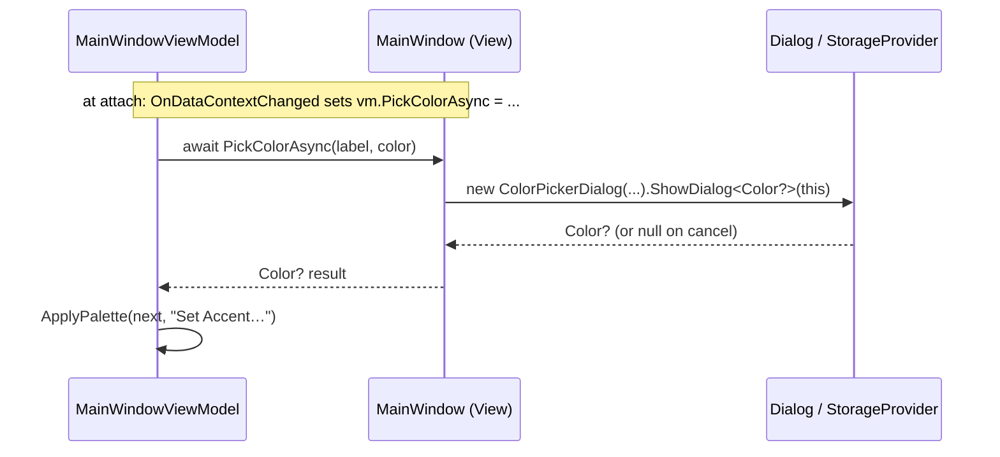

# 05 — Views & Dialogs

> The XAML layer, the `Func<>` hook trick that keeps VMs UI-free, and the modal dialogs.

Related: [[Home]] · [[04-ViewModels-and-MVVM]] · [[11-Color-Picker-and-ColorWheel]] · [[08-Wallpaper-Tools]]

## The problem: VMs must not know about windows

A view-model needs to *open a file picker* or *show a confirm dialog*, but those are Avalonia
`Window`/`StorageProvider` operations. Putting them in the VM would drag UI types into the VM layer
and make the VM untestable. The codebase solves this with **`Func<>` hook properties**: the VM
declares a delegate for each capability it needs, and the View fills them in.

### VM side — declare the capability as a delegate

```csharp
// MainWindowViewModel
public Func<Task<IReadOnlyList<string>>>? PickImagesAsync { get; set; }
public Func<string, string, Task<bool>>? ConfirmAsync { get; set; }
public Func<string, Color, Task<Color?>>? PickColorAsync { get; set; }
public Func<ImageEditorViewModel, Task<bool>>? ShowImageEditorAsync { get; set; }
// ...and several more (single-image pick, folder pick, name prompt, image preview)
```

The VM calls them defensively — a null hook (e.g. at design time, or before wiring) is a no-op:

```csharp
public Task PreviewImage(string path) => PreviewImageHook?.Invoke(path) ?? Task.CompletedTask;
```

### View side — fill the hooks in `OnDataContextChanged`

`MainWindow.axaml.cs` subscribes to `DataContextChanged` and, once the VM is attached, points each
hook at a real Avalonia implementation:

```csharp
private void OnDataContextChanged(object? sender, System.EventArgs e)
{
    if (DataContext is not MainWindowViewModel vm) return;

    vm.PickImagesAsync = PickImagesAsync;
    vm.PickSingleImageHook = () => PickSingleFileAsync("Choose a wallpaper",
        new[] { "*.png", "*.jpg", "*.jpeg", "*.webp", "*.gif", "*.bmp" }, "Images");
    vm.PickFileForImportHook = () => PickSingleFileAsync("Import a Base16 scheme",
        new[] { "*.yaml", "*.yml" }, "Base16 YAML");
    vm.PickFolderAsync = PickFolderAsync;
    vm.PreviewControlProvider = () => this.FindControl<Control>("PreviewRoot");
    vm.ConfirmAsync = (title, message) =>
        new ConfirmDialog(title, message).ShowDialog<bool>(this);
    vm.PromptForNameAsync = (title, message, defaultText, imagePath) =>
        new TextPromptDialog(title, message, defaultText, imagePath).ShowDialog<string?>(this);
    vm.PreviewImageHook = path => new ImagePreviewDialog(path).ShowDialog(this);
    vm.PickColorAsync = (label, color) =>
        new ColorPickerDialog(label, color).ShowDialog<Color?>(this);
    vm.ShowImageEditorAsync = editorVm =>
        new ImageEditorDialog(editorVm).ShowDialog<bool>(this);
}
```

The actual pickers use Avalonia's `StorageProvider`, returning local paths:

```csharp
private async Task<string?> PickSingleFileAsync(string title, string[] patterns, string typeName)
{
    IReadOnlyList<IStorageFile> files = await StorageProvider.OpenFilePickerAsync(new FilePickerOpenOptions
    {
        Title = title,
        AllowMultiple = false,
        FileTypeFilter = new[] { new FilePickerFileType(typeName) { Patterns = patterns } },
    });
    return files.FirstOrDefault()?.TryGetLocalPath();
}
```

> `PreviewControlProvider` is the inverse direction: instead of the View doing something for the VM,
> it hands the VM a reference to a named control (`PreviewRoot`) so `GeneratePreview` can rasterize
> it via `PreviewRenderService`. See [[03-Services-Layer]].

### Hook round-trip



## The dialogs

All dialogs are small `Window`s returning a typed result via `ShowDialog<T>(owner)`.

| Dialog | Returns | Purpose |
|---|---|---|
| `ConfirmDialog` | `bool` | Yes/No confirmation (e.g. delete a theme). |
| `TextPromptDialog` | `string?` | Name entry; optionally previews a thumbnail of the image being named. Enter confirms, Esc cancels. |
| `ColorPickerDialog` | `Color?` | Hosts the [[11-Color-Picker-and-ColorWheel|ColorWheel]] + hex/RGB/HSB spinners + eyedropper. |
| `ImagePreviewDialog` | *(void)* | Full-size modal image preview; click or Esc to close. |
| `ImageEditorDialog` | `bool` | Hosts `ImageEditorViewModel` (sliders + live preview). `true` = user saved. Disposes the VM's cached bitmap on close. |

`null`/`false` returns uniformly mean "user cancelled", which the VM treats as "do nothing".

## Value converters — `Converters.cs`

Four one-way `IValueConverter`s, registered as resources in `App.axaml`:

- `ColorToBrushConverter` — wrap an Avalonia `Color` in a `SolidColorBrush`.
- `HexToBrushConverter` — parse a hex string to a brush (transparent on failure).
- `PathToFileNameConverter` — show `Path.GetFileName(path)` in lists.
- `SwatchSelectionBrushConverter` — white border when a swatch `IsSelected`, else transparent.

## XAML gotchas (recap)

- `MainWindow.axaml` sets `x:CompileBindings="False"` — bindings there resolve at runtime, so a
  typo won't fail the build. Other XAML uses compiled bindings.
- `Grid` has no `RowSpacing`/`ColumnSpacing` in Avalonia 11.2 — use per-child `Margin`. See
  [[01-Overview#Avalonia 11.2 gotchas]].
