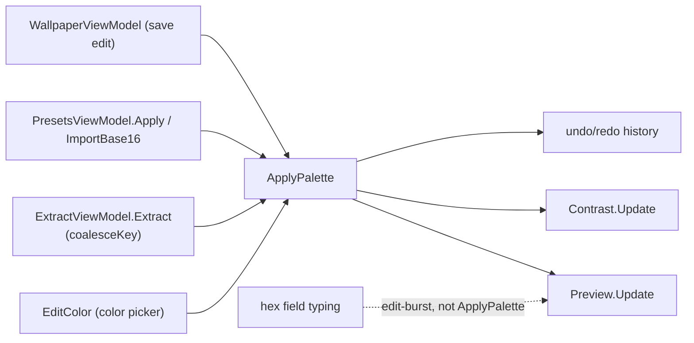

# 06 — Palette Flow & `IPaletteHost`

> The single most important pattern in the app: one choke point for every color change.

Related: [[Home]] · [[04-ViewModels-and-MVVM]] · [[07-Palette-Extraction]] · [[Data-Flows]] · [[Glossary]]

## The invariant

Every tab that can change colors — hand edits, the color picker, palette extraction, presets, the
wallpaper editor — pushes its result through **one method**:

```csharp
void ApplyPalette(ThemeColors next, string status, string? coalesceKey = null);
```

Because everything funnels here, this method can keep the three dependent views in lock-step: the
**live preview**, the **undo/redo history**, and the **contrast panel**. If any code path mutated
`_working` directly, one of those would silently drift. *Don't mutate the palette around it.*

## The `IPaletteHost` interface

The main VM implements `IPaletteHost`; each tab holds a reference to it (not to the concrete VM).

```csharp
public interface IPaletteHost
{
    ThemeColors CurrentPalette { get; }
    void ApplyPalette(ThemeColors next, string status, string? coalesceKey = null);
    void SetLightMode(bool light);
    void SetStatus(string status);
    Task<string?> PickImageAsync();
    Task<string?> PickFileAsync();
    Task<BackgroundAddResult?> AddBackground(string sourcePath);
    string StagingDir { get; }   // temp dir for downloaded/edited wallpapers pre-save
}
```

`CurrentPalette` lets a tab read the current colors as a starting point (e.g. the Extract tab reads
the accent hue to seed its "dominant hue"); `ApplyPalette` is the only way to write them back.

## What `ApplyPalette` does

```csharp
public void ApplyPalette(ThemeColors next, string status, string? coalesceKey = null)
{
    // Fold consecutive same-key applies (e.g. a slider drag) into one undo step.
    bool coalesce = coalesceKey is not null && coalesceKey == _lastCoalesceKey;
    if (!coalesce)
    {
        PushUndo(_working.Clone());
        _redo.Clear();
    }
    _lastCoalesceKey = coalesceKey;
    _editBurstActive = false;

    _working = next.Clone();      // defensive copy: callers can't mutate our state afterward
    BuildColorFields();           // rebuild the editable ColorField list
    Preview.Update(_working);     // recompute preview brushes
    Contrast.Update(_working);    // recompute WCAG rows
    StatusText = status;
}
```

Note the **`Clone()`** on both the undo snapshot and the incoming palette. `ThemeColors` is a mutable
class, so cloning is what makes the history immutable and prevents a caller from later mutating a
palette we've already stored.

## Undo / redo

History is a bounded `LinkedList<ThemeColors>` for undo and a `Stack<ThemeColors>` for redo
(`HistoryLimit = 50`). Each entry is a full palette snapshot — simple and cheap for 22 colors.

```mermaid
stateDiagram-v2
    [*] --> Idle
    Idle --> Idle: ApplyPalette (new coalesceKey)\npush undo, clear redo
    Idle --> Idle: ApplyPalette (same coalesceKey)\nfold into last step
    Idle --> Undone: Undo()\nredo.push(working); working = undo.last
    Undone --> Idle: ApplyPalette\n(clears redo)
    Undone --> Undone: Undo() (more history)
    Undone --> Idle: Redo()\nworking = redo.pop
```



```csharp
[RelayCommand] private void Undo()
{
    if (_undo.Count == 0) return;
    _redo.Push(_working.Clone());
    _working = _undo.Last!.Value;
    _undo.RemoveLast();
    AfterHistoryMove("Undid last change.");
}
```

`AfterHistoryMove` does the same "rebuild fields + refresh preview/contrast" work as `ApplyPalette`,
then raises `CanUndo`/`CanRedo` change notifications so the toolbar buttons enable/disable.

## Two ways changes accumulate

There are **two distinct grouping mechanisms**, for two kinds of input:

### 1. `coalesceKey` — for programmatic bursts (slider drags)
Dragging an Extract slider calls `Extract()` many times a second, each producing a fresh palette. We
don't want 40 undo steps for one drag. The Extract tab passes a stable key
(`"extract:" + wallpaperPath`); as long as the key matches the previous apply, `ApplyPalette` folds
the change into the existing undo step instead of pushing a new one. Moving to a different control or
wallpaper changes the key and starts a new step.

### 2. `_editBurstActive` — for manual hex-field typing
When you type into a `ColorField`, `OnColorFieldChanged` fires per keystroke. The first change in a
run snapshots the pre-edit palette and sets `_editBurstActive = true`; subsequent keystrokes skip
the snapshot. Any `ApplyPalette` or history move resets the flag, so the next manual edit starts a
fresh step.

```csharp
private void OnColorFieldChanged(ColorField field)
{
    if (field.NormalizedHex is { } hex)
    {
        if (!_editBurstActive)               // snapshot once per run of manual edits
        {
            PushUndo(_working.Clone());
            _redo.Clear();
            _lastCoalesceKey = null;
            _editBurstActive = true;
        }
        _working.Set(field.Key, hex);
        Preview.Update(_working);
        Contrast.Update(_working);
    }
}
```

> Note this path updates preview/contrast but **doesn't** rebuild the `ColorField` list — the field
> the user is typing in *is* the source of truth here, so rebuilding it would fight the caret. The
> committed color-picker path (`EditColor`) instead goes through `ApplyPalette`, which does rebuild.

## Who calls `ApplyPalette`



See [[Data-Flows]] for the full end-to-end sequences.
