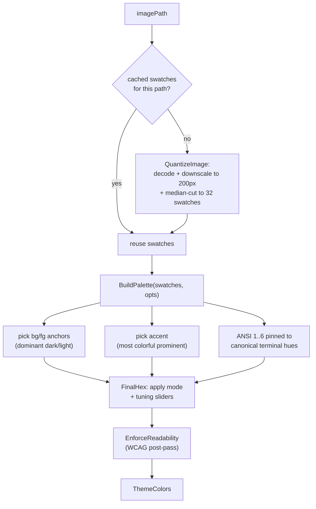

# 07 — Palette Extraction

> How a wallpaper becomes a full 22-key Omarchy palette, plus the shared `ColorMath` toolbox.

Related: [[Home]] · [[06-Palette-Flow-and-IPaletteHost]] · [[08-Wallpaper-Tools]] · [[10-Theme-Persistence]] · [[Glossary]]

`PaletteExtractionService.Extract(imagePath, opts)` is a **pure function of (image, options)** that
returns a `ThemeColors`. Purity is deliberate: the Extract tab re-runs it on every slider tick (see
[[04-ViewModels-and-MVVM|ExtractViewModel]]), so it must be cheap and side-effect-free.

## The pipeline



### 1. Quantize (image-only, cached)

Quantization depends only on the image, so the service keeps a **single-entry cache** (`_cachedPath`
/ `_cachedSwatches`). It's UI-thread-only (the Extract tab), so no locking is needed.

```csharp
public ThemeColors Extract(string imagePath, ExtractionOptions opts)
{
    List<Swatch> swatches;
    if (imagePath == _cachedPath && _cachedSwatches is not null)
        swatches = _cachedSwatches;                 // slider re-run: skip decode+quantize
    else
    {
        swatches = QuantizeImage(imagePath, 32);
        _cachedPath = imagePath;
        _cachedSwatches = swatches;
    }
    if (swatches.Count == 0) return new ThemeColors();
    return BuildPalette(swatches, opts);
}
```

`QuantizeImage` decodes with SkiaSharp, downscales so the longest side is ~200px (keeps the scan
cheap regardless of source resolution), then reads pixels via `GetPixelSpan()` — indexing the raw
byte buffer directly, because `SKBitmap.GetPixel` allocates/marshals an `SKColor` per call and would
dominate a tight loop. A `Swatch` is a quantized color plus its pixel population (`Weight`).

### 2. Median-cut

`MedianCut` repeatedly splits the color box with the largest **range × population**, so dominant
regions resolve into more swatches than sparse noise:

```csharp
(int range, char channel) = WidestChannel(boxes[i]);
long priority = (long)range * boxes[i].Count;   // range × population
```

Each final box collapses to its average color, weighted by pixel count.

### 3. Build the palette

`BuildPalette` maps swatches onto the 22 keys with intent, not just "top N colors":

- **Anchors (bg/fg)** — the dominant *dark* and *light* colors by weight (not extreme outliers, so a
  lone JPEG-black pixel or specular highlight can't win). In light mode, bg/fg swap. Anchors are
  shaped to a cohesive lightness band with tamed saturation:
  ```csharp
  ColorMath.Hsl ShapeBackground(Hsl h, bool light) =>
      new(h.H, Math.Min(h.S, 0.22), light ? 0.94 : 0.12);
  ```
- **Accent** — the most colorful *prominent* swatch, scored by
  `saturation × mid-lightness-ness × log(weight)`.
- **ANSI 1–6 / 9–14** — each pinned to a **canonical terminal hue** so red stays red and green stays
  green regardless of the wallpaper. The nearest chromatic swatch is nudged ~65% toward canonical; if
  no swatch is near a hue (e.g. a monochrome wallpaper), one is synthesized.
  ```csharp
  static readonly double[] AnsiHues = { 0, 120, 55, 225, 300, 185 }; // r,g,y,b,m,c
  ```
- **ANSI 0/8/7/15** — near-neutral black/white shades, mode-independent.

### 4. Modes & tuning sliders — `FinalHex`

Non-anchor colors pass through the [[Glossary#Extraction mode|extraction mode]] then the tuning
sliders. Anchors skip hue/saturation shaping to stay neutral-ish:

```csharp
static string FinalHex(Hsl hsl, ExtractionOptions opts, bool isAnchor = false)
{
    if (!isAnchor) hsl = ApplyMode(hsl, opts.Mode, opts.DominantHue);
    if (!isAnchor)
    {
        hsl = ColorMath.WithVibrance(hsl, opts.Vibrance);
        hsl = hsl with { S = Math.Clamp(hsl.S * opts.Saturation, 0, 1) };
    }
    hsl = ColorMath.WithContrast(hsl, opts.Contrast);
    hsl = hsl with { L = Math.Clamp(hsl.L * opts.Brightness, 0, 1) };
    hsl = ApplyShadowsHighlights(hsl, opts);
    Rgb rgb = ColorMath.HslToRgb(hsl);
    if (Math.Abs(opts.Temperature) > 1e-6) rgb = ColorMath.WithTemperature(rgb, opts.Temperature);
    return ColorMath.ToHex(rgb);
}
```

The eight modes (`Normal, Monochromatic, Analogous, Pastel, Material, Muted, Bright, Colorful`) are
small HSL transforms in `ApplyMode`. `Monochromatic` slams every hue to `DominantHue`; `Material`
quantizes S and L to quarter-steps; etc.

### 5. Readability post-pass

`EnforceReadability` runs **last**, on the final hex values, so the sliders can't undo it. It nudges
foreground/accent/ANSI lightness until each clears a WCAG ratio against the background:

```csharp
colors.Foreground = ColorMath.EnsureContrast(colors.Foreground, colors.Background, 4.5);
colors.Accent     = ColorMath.EnsureContrast(colors.Accent,     colors.Background, 3.0);
```

### Options

`ExtractionOptions` slider values are **neutral at their defaults** (factors `= 1`, additive `= 0`),
so an untouched extraction is faithful to the image. `DominantHue` is seeded by the Extract tab from
the current palette's accent hue.

## `ColorMath` — the shared toolbox

`Models/ColorMath.cs` is pure, dependency-free color math used by extraction, the tuning sliders,
presets, self-theming ([[09-Live-Theming-and-Self-Sync|AppThemeSync]]), and the contrast panel.

| Group | Members |
|---|---|
| Types | `Rgb`, `Hsl`, `Cmyk` (all `readonly record struct`) |
| Convert | `ToRgb/ToHex`, `RgbToHsl/HslToRgb`, `ToHsl/FromHsl`, `RgbToCmyk` |
| WCAG | `RelativeLuminance`, `ContrastRatio` → [1,21], `Grade` → "AAA"/"AA"/"AA Large"/"Fail" |
| Adjust | `WithVibrance`, `WithContrast`, `WithTemperature`, `AdjustHsl` |
| Blend | `Mix`, `MixHex`, `ReadableTextOn` (black or white for best contrast) |
| Geometry | `HueDistance` (shortest arc, [0,180]), `EnsureContrast` (nudge lightness to hit a ratio) |

Two worth knowing well:

```csharp
// WCAG contrast ratio — used by the contrast panel and EnsureContrast.
public static double ContrastRatio(string a, string b)
{
    double la = RelativeLuminance(a), lb = RelativeLuminance(b);
    double hi = Math.Max(la, lb), lo = Math.Min(la, lb);
    return (hi + 0.05) / (lo + 0.05);
}

// Push lightness away from (positive) or toward (negative) mid-gray.
public static Hsl WithContrast(Hsl h, double amount) =>
    h with { L = Clamp01(0.5 + (h.L - 0.5) * (1 + amount)) };
```

> **HSV/HSB is intentionally absent** from `ColorMath`. Avalonia's `HsvColor` / `Color.ToHsv()`
> already provide it, so the [[11-Color-Picker-and-ColorWheel|color picker]] uses those rather than
> duplicating the math. `ColorMath` only adds `Cmyk` (an informational readout).
