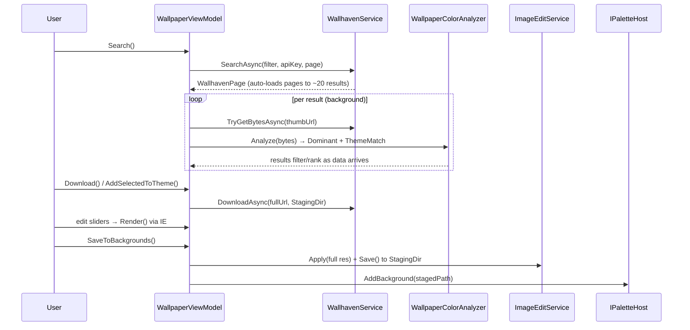

# 08 — Wallpaper Tools

> Searching wallhaven.cc, analyzing thumbnail colors, editing images with SkiaSharp, and managing a
> theme's backgrounds.

Related: [[Home]] · [[07-Palette-Extraction]] · [[10-Theme-Persistence]] · [[06-Palette-Flow-and-IPaletteHost]] · [[Glossary]]

Four services and two view-models cooperate here:

- `WallhavenService` — search/download client for wallhaven.cc.
- `WallpaperColorAnalyzer` — pull dominant colors out of thumbnails, score theme match.
- `ImageEditService` — SkiaSharp adjustments/filters + named presets.
- `SettingsService` — holds the optional Wallhaven API key.
- `WallpaperViewModel` (the *Wallpaper* tab) and `CurrentWallpapersViewModel` (the *Current
  Wallpapers* tab).

## `WallhavenService`

A thin `HttpClient` client (20s timeout) for the public search API. Anonymous searches are SFW;
passing an API key unlocks NSFW.

```csharp
sealed record WallhavenResult(string Id, string ThumbUrl, string FullUrl, string Resolution);
sealed record WallhavenPage(IReadOnlyList<WallhavenResult> Items, int LastPage);

Task<WallhavenPage> SearchAsync(WallpaperFilter filter, string? apiKey = null, int page = 1);
Task<byte[]?> TryGetBytesAsync(string url);                 // null on network failure
Task<string>  DownloadAsync(string url, string destDir);   // returns saved path
```

Network failures return `null` / throw clean messages surfaced in the status bar (graceful
degradation — see [[01-Overview#Key invariants]]). The service also exposes wallhaven's fixed palette
`Colors` and `NearestColor(hex)`, which snaps an arbitrary hex to the nearest palette color (Euclidean
RGB) for the color filter.

### `WallpaperFilter` (model)

Maps UI controls to API query params. Booleans become 3-bit **purity** (`sfw|sketchy|nsfw`) and
3-bit **category** (`general|anime|people`) masks. `PurityMask(hasApiKey)` drops NSFW when there's no
key; `CategoriesMask()` defaults to all-on when nothing is selected.

## `WallpaperColorAnalyzer`

Pure and stateless — safe to run on background threads while thumbnails stream in. Decodes thumbnail
bytes with SkiaSharp and builds a 16-level-per-channel histogram.

```csharp
sealed record WeightedColor(ColorMath.Rgb Color, double Weight);          // fraction of image
sealed record ImageColors(IReadOnlySet<string> Dominant,                  // wallhaven palette hexes present
                          IReadOnlyList<WeightedColor> Palette);          // compact weighted palette

ImageColors Analyze(byte[] imageBytes);
static double ThemeMatch(ImageColors image, IReadOnlyList<ColorMath.Rgb> targets);
```

Two consumers:
- **`Dominant`** drives the multi-color filter (which wallhaven swatches the image contains).
- **`ThemeMatch`** scores a thumbnail against the current theme's colors (accent + ANSI + bg/fg) so
  the tab can rank/filter by "matches this theme".

## `ImageEditService`

Non-destructive raster editing with SkiaSharp. `ImageEditOptions` is an immutable record with neutral
defaults (`Brightness=Contrast=Saturation=1`, everything else 0):

```csharp
sealed record ImageEditOptions
{
    float Brightness { get; init; } = 1f;   float Contrast { get; init; } = 1f;
    float Saturation { get; init; } = 1f;   float Exposure { get; init; }        // stops (2^x)
    float Blur { get; init; }               // Gaussian sigma px
    float Sharpen { get; init; }            float Vignette { get; init; }
    float Grain { get; init; }              SKColor ToneColor { get; init; }
    float ToneStrength { get; init; }
}

SKBitmap Apply(string imagePath, ImageEditOptions o);   // decode + apply
SKBitmap Apply(SKBitmap src, ImageEditOptions o);       // reuse a decoded bitmap
void Save(SKBitmap bitmap, string destPath);            // PNG or JPEG by extension
IReadOnlyList<string> PresetNames { get; }              // Cinematic, Vintage, Noir, …
ImageEditOptions Preset(string name);
```

The two `Apply` overloads matter for responsiveness: the editor decodes the source **once** into a
preview-resolution `SKBitmap`, then re-applies options to that in-memory bitmap on every slider move,
and only re-runs at full resolution on save. `BitmapInterop.ToAvalonia` converts the result for
display (see [[03-Services-Layer]]).

## The two tabs

### `WallpaperViewModel` (Wallpaper tab)
Search + browse + embedded editor. Flow:



Thumbnails load and analyze off-thread per image, so results appear and filter progressively rather
than blocking on the whole page. `MatchTheme` ranks by `ThemeMatch`; `MatchesOnly` hides results
missing a ticked color. Downloaded/edited images land in the host's **staging dir**
(`IPaletteHost.StagingDir`, a temp folder) until the theme is saved — see [[Glossary#Staging dir]].

### `CurrentWallpapersViewModel` (Current Wallpapers tab)
Manages backgrounds already in the *open* theme. Its `Items` collection is the **single source of
truth** for the theme's background list; `MainWindowViewModel.BuildThemeFromEditor` reads it at save
time. Commands: `Add`, `Rename` (to the `NN-slug.ext` convention), `MoveUp`/`MoveDown` (reorder +
renumber), `Remove`, `PurgeAll`, `Edit` (opens `ImageEditorDialog`, applies full-res), `Preview`. All
file operations go through [[10-Theme-Persistence|ThemeRepository]].
