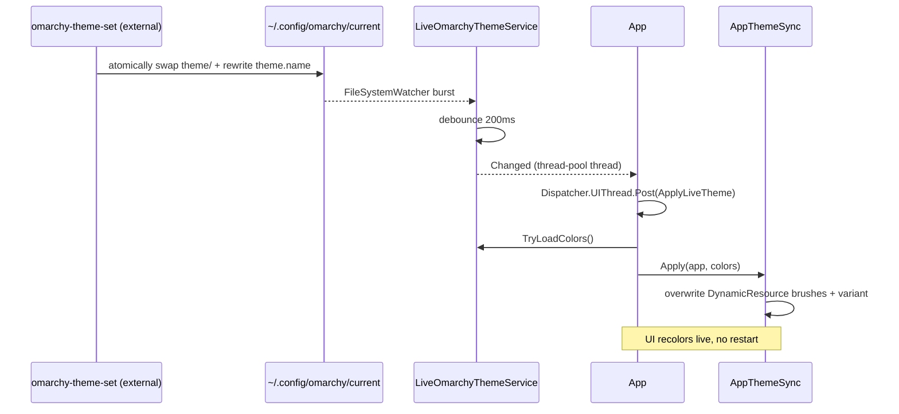

# 09 — Live Theming & Self-Sync

> The app recolors its **own** chrome to match the live Omarchy desktop theme, and can apply the
> theme you're editing to the desktop — both degrading gracefully when Omarchy isn't installed.

Related: [[Home]] · [[02-Bootstrap-and-Composition-Root]] · [[07-Palette-Extraction]] · [[10-Theme-Persistence]]

Three pieces cooperate: `LiveOmarchyThemeService` (watches the applied theme), `AppThemeSync` (maps a
palette onto Avalonia resources), and `OmarchyCliService` (applies a theme to the desktop). Note the
deliberate split: pure I/O lives in `Services/`, while `AppThemeSync` sits at the app root **because
it touches Avalonia**.

## `LiveOmarchyThemeService` — track the applied theme

Distinct from the theme you're *editing*, this tracks the theme currently *applied* to the desktop by
reading `~/.config/omarchy/current/theme/colors.toml` and watching the enclosing `current/` folder.
`omarchy-theme-set` swaps that `theme` folder atomically (rm + mv) and rewrites `theme.name`, so a
single watcher on the parent catches every switch.

```csharp
public LiveOmarchyThemeService()
{
    string home = Environment.GetFolderPath(Environment.SpecialFolder.UserProfile);
    _currentDir  = Path.Combine(home, ".config", "omarchy", "current");
    _colorsPath  = Path.Combine(_currentDir, "theme", "colors.toml");
    _namePath    = Path.Combine(_currentDir, "theme.name");
    IsAvailable  = File.Exists(_colorsPath);   // graceful degradation
}

public ThemeColors? TryLoadColors()   // null if unavailable / mid-swap / unreadable
{
    try { return File.Exists(_colorsPath) ? ColorsTomlService.Load(_colorsPath) : null; }
    catch { return null; }
}
```

### Debounced watching

A theme switch emits a burst of filesystem events (directory swap + `theme.name` write). The service
debounces them with a 200 ms one-shot `Timer` so it re-reads once, after the atomic `mv` settles, and
raises `Changed` on a thread-pool thread:

```csharp
private void OnFsEvent(object sender, FileSystemEventArgs e)
{
    _debounce?.Dispose();
    _debounce = new Timer(_ =>
    {
        Log.Debug("Live Omarchy theme changed; re-reading colors");
        Changed?.Invoke(this, EventArgs.Empty);
    }, null, 200, Timeout.Infinite);
}
```

It's constructed in the [[02-Bootstrap-and-Composition-Root|composition root]], kept alive in a field
for the app's lifetime, and disposed on exit.

## `AppThemeSync` — paint the app with the palette

`App` subscribes to `Changed` and marshals to the UI thread before calling `AppThemeSync.Apply`,
which overwrites the `DynamicResource` brushes that `MainWindow.axaml` consumes. It derives an
elevation hierarchy by mixing background toward foreground, sets Fluent's whole accent-color family,
and flips the light/dark variant by background luminance:

```csharp
public static void Apply(Application app, ThemeColors c)
{
    IResourceDictionary res = app.Resources;
    string bg = c.Background, fg = c.Foreground, accent = c.Accent;

    SetBrush(res, "AppBackgroundBrush",  bg);
    SetBrush(res, "AppSurfaceBrush",     ColorMath.MixHex(bg, fg, 0.06));
    SetBrush(res, "AppSurfaceAltBrush",  ColorMath.MixHex(bg, fg, 0.11));
    SetBrush(res, "AppBorderBrush",      ColorMath.MixHex(bg, fg, 0.22));
    SetBrush(res, "AppForegroundBrush",  fg);
    SetBrush(res, "AppMutedBrush",       ColorMath.MixHex(fg, bg, 0.40));
    SetBrush(res, "AppAccentBrush",      accent);
    SetBrush(res, "AppAccentForegroundBrush", ColorMath.ReadableTextOn(accent));
    SetBrush(res, "AppSelectionBrush",   c.SelectionBackground);
    SetBrush(res, "AppSelectionForegroundBrush", c.SelectionForeground);
    SetBrush(res, "AppDangerBrush",      c.Ansi[1]); // ANSI red

    res["SystemAccentColor"]       = Color.Parse(accent);
    res["SystemAccentColorLight1"] = Shift(accent,  0.08);   // …Light2/3, Dark1/2/3 too
    // ...
    app.RequestedThemeVariant =
        ColorMath.RelativeLuminance(bg) < 0.5 ? ThemeVariant.Dark : ThemeVariant.Light;
}
```

Because the brushes are `DynamicResource`, the whole UI recolors live with no restart. The blending
and luminance helpers all come from `ColorMath` (see [[07-Palette-Extraction#ColorMath — the shared toolbox]]).

## `OmarchyCliService` — apply to the desktop

A thin wrapper over the `omarchy-theme-set` CLI. `IsAvailable` is a `PATH` probe; when false, the
*Apply* button is disabled (`MainWindowViewModel.CanApply`) and the app is a pure editor.

```csharp
record CliResult(bool Success, string Output);
Task<CliResult> ApplyThemeAsync(string themeName);   // runs `omarchy-theme-set <name>`
```

`MainWindowViewModel.ApplyAsync` saves first (so disk matches the editor), then invokes the CLI and
reports success/failure in the status bar.

## End-to-end: switching the desktop theme externally


