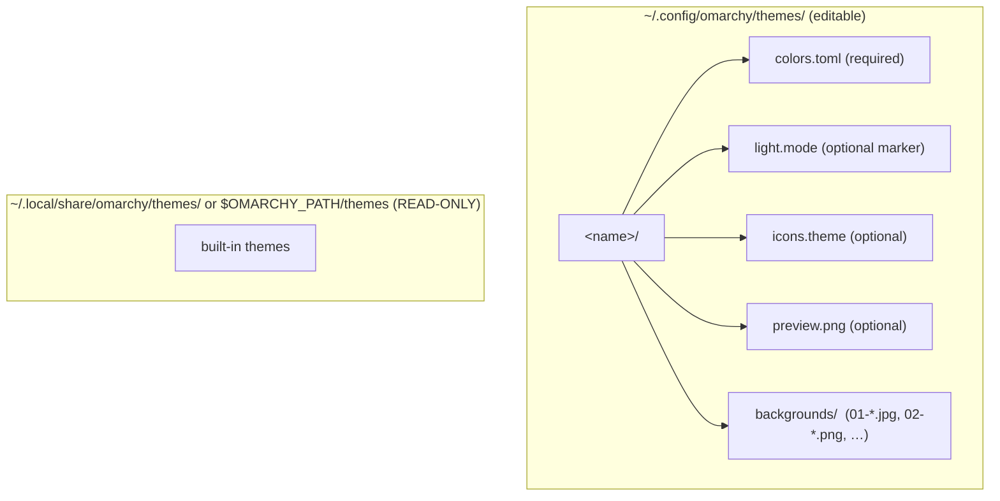
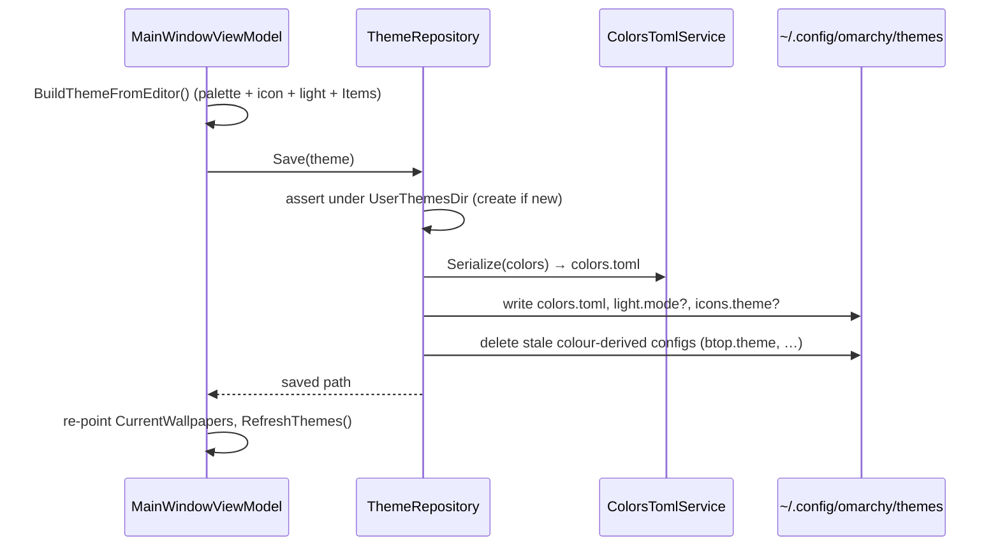

# 10 — Theme Persistence

> The on-disk theme layout, the data models, and `ThemeRepository` — the one component allowed to
> touch theme files.

Related: [[Home]] · [[07-Palette-Extraction]] · [[09-Live-Theming-and-Self-Sync]] · [[08-Wallpaper-Tools]] · [[Glossary]]

## On-disk layout



- **User themes** live in `~/.config/omarchy/themes/<name>/` and are editable.
- **Built-in themes** live in the system dir (`$OMARCHY_PATH/themes`, else
  `~/.local/share/omarchy/themes`) and are **read-only**.
- `Theme.IsBuiltIn` distinguishes them. **`ThemeRepository` only ever writes to the user dir** — it
  refuses to delete or overwrite the system dir. This is a hard invariant.

## The data models

### `ThemeColors` (`Models/ThemeColors.cs`)

The full 22-key palette: six named colors + 16 ANSI colors, ordered exactly as Omarchy's template
substitution (`omarchy-theme-set-templates`) expects. It's a mutable class — hence the `Clone()`
calls in [[06-Palette-Flow-and-IPaletteHost|ApplyPalette]].

```csharp
public string Accent { get; set; } = "#7aa2f7";   // + Cursor, Foreground, Background,
                                                   //   SelectionForeground, SelectionBackground
public string[] Ansi { get; } = new string[16] { /* Tokyo Night defaults */ };

public IEnumerable<KeyValuePair<string,string>> AsPairs();   // canonical order, drives ColorField list
public void Set(string key, string value);                   // "accent"/"color4"/… → field
public ThemeColors Clone();                                  // deep copy (Ansi array copied)

public static string? NormalizeHex(string? value);           // → "#rrggbb" lowercase, or null
public static string  ToRgb(string hex);                     // "#1a1b26" → "26,27,38" for {{ key_rgb }}
```

`AsPairs()` and `Set()` are the bridge between the strongly-typed palette and the flat key/value
world of `colors.toml` and the editable `ColorField` list.

### `Theme` (`Models/Theme.cs`)

A theme folder as an object: `Name` (kebab-case id), `Path` (`null` until saved), `IsBuiltIn`,
`Colors`, `IconTheme`, `LightMode`, and `Backgrounds` (absolute paths). Helpers convert between the
kebab-case id and a display name:

```csharp
public string DisplayName => ToDisplayName(Name);     // "tokyo-night" → "Tokyo Night"
public static string ToDisplayName(string name);
public static string ToSlug(string display);          // "Tokyo Night" → "tokyo-night"
```

### `WallpaperFilter`

Covered in [[08-Wallpaper-Tools]] (it belongs to the wallhaven flow, not persistence).

## `ColorsTomlService` — read/write `colors.toml`

Static, tolerant parser + canonical serializer. It parses flat `key = "#value"` lines, ignoring
comments and coping with quoted or unquoted values (mirroring the sed-style extraction Omarchy's own
templates use), and re-serializes in Omarchy's canonical layout so diffs against hand-authored themes
stay clean.

```csharp
public static ThemeColors Parse(string content);   // tolerant: skips comments, handles quotes
public static ThemeColors Load(string path);
public static string      Serialize(ThemeColors c); // named keys, blank line, color0..15
public static void        Save(string path, ThemeColors colors);
```

```csharp
// Serialize output shape:
// accent = "#7aa2f7"
// cursor = "#c0caf5"
// ... (six named)
//
// color0 = "#32344a"
// ... color15
```

Consumed by `ThemeRepository` (load/save), [[09-Live-Theming-and-Self-Sync|LiveOmarchyThemeService]]
(read the applied theme), and `PresetService` (Base16 import path).

## `ThemeRepository` — the file-facing API

The central persistence component. Everything that reads or writes a theme folder goes through here.

```csharp
string UserThemesDir { get; }     // ~/.config/omarchy/themes
string SystemThemesDir { get; }   // $OMARCHY_PATH/themes or ~/.local/share/omarchy/themes

IReadOnlyList<Theme> ListThemes();          // user + built-in, deduped by name, sorted
Theme  Load(string dir);                    // colors, icons, light mode, backgrounds
string Save(Theme theme);                   // writes to USER dir only; returns path
Theme  Clone(Theme source, string newName); // copy (incl. backgrounds) into user dir
bool   Exists(string name);
void   Delete(Theme theme);                 // refuses built-in

// Backgrounds (Omarchy switcher convention: NN-slug.ext, ordered)
readonly record struct BackgroundAddResult(string Path, bool WasNew);
BackgroundAddResult AddBackground(Theme theme, string sourceImagePath);
string RenameBackground(Theme theme, string currentPath, string newBaseName);
IReadOnlyList<string> ReorderBackgrounds(Theme theme, IReadOnlyList<string> orderedPaths);
void   RemoveBackground(Theme theme, string imagePath);
string SetPreviewImage(Theme theme, string sourceImagePath); // encodes to preview.png (SkiaSharp)
```

### Safety details worth knowing

- **User-dir guard.** `Save`/`Delete` verify the target is under `UserThemesDir` (`IsUnder` path
  containment) and refuse built-ins. Saving over an opened built-in creates an editable copy instead.
- **Background numbering.** Backgrounds are prefixed `NN-` so Omarchy's switcher cycles them in
  order. `ReorderBackgrounds` renumbers via temporary names first, to avoid collisions when two files
  would swap numbers.
- **`preview.png` is always PNG.** `SetPreviewImage` re-encodes whatever you pick to PNG, because
  Omarchy looks for `preview.png` first in its theme menu.

## Save flow



The background list saved here comes from
[[08-Wallpaper-Tools|CurrentWallpapersViewModel.Items]], the single source of truth for the open
theme's wallpapers.

### Stripping colour-derived configs on save

`Save` writes `colors.toml` and then **deletes any colour-derived config files** the theme folder
carries (`ThemeRepository.TemplatedThemeFiles`: `btop.theme`, `alacritty.toml`, `foot.ini`,
`kitty.conf`, `ghostty.conf`, `mako.ini`, `swayosd.css`, `walker.css`, `hyprland.conf`,
`hyprlock.conf`).

These files are things Omarchy generates from `colors.toml` via its template engine
(`$OMARCHY_PATH/default/themed/*.tpl`, run by `omarchy-theme-set-templates`). The catch is that
`omarchy-theme-set` only templates a file **when the theme doesn't already ship one** — a physical
copy in the theme folder wins verbatim and `colors.toml` is ignored for that app. Cloning a built-in
(`Clone` copies *every* file) drags along its hand-authored `btop.theme` etc., so without this step
an edited palette would land in `colors.toml` while btop kept the **original** theme's colours. By
removing them, we hand ownership back to Omarchy's template engine, which regenerates them from the
palette we just wrote.

The list deliberately **excludes** files that can carry structural (non-colour) customisation a
theme author wrote by hand — `waybar.css`, `helix.toml`, `obsidian.css` — so those are preserved
rather than silently discarded.
