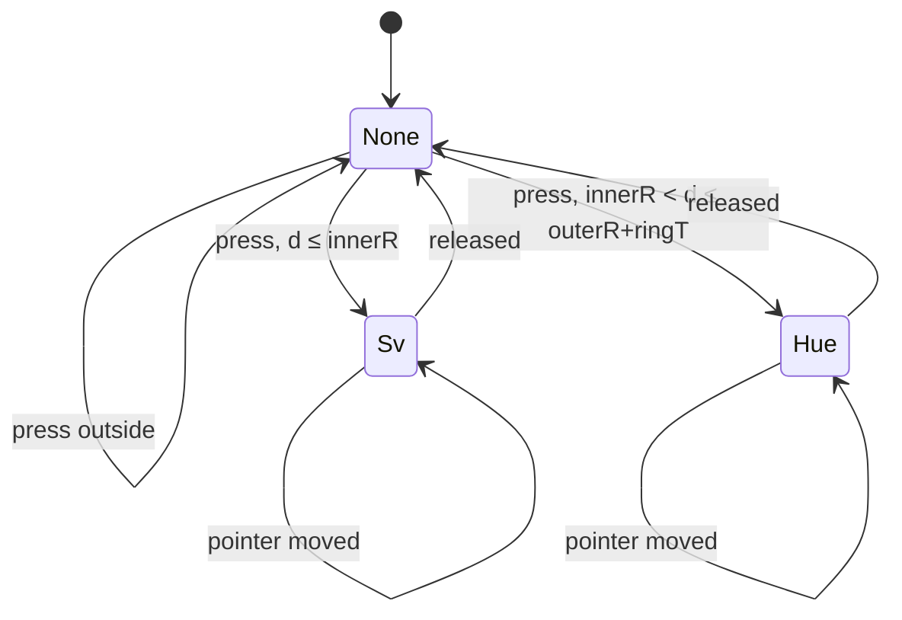
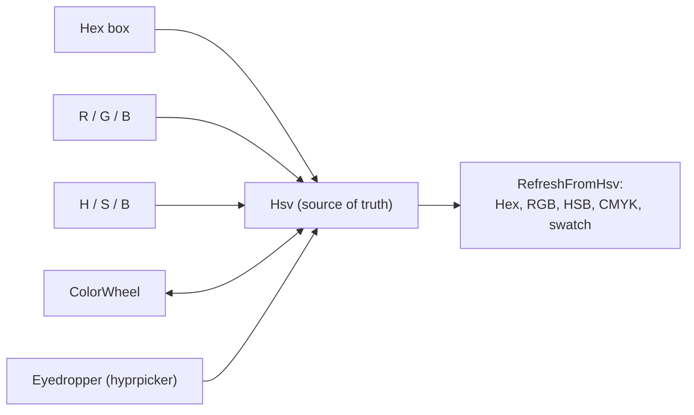

# 11 — Color Picker & ColorWheel

> A Photoshop-style picker: a custom `ColorWheel` control plus a view-model that keeps hex/RGB/HSB/
> CMYK readouts in sync, all funneling through one HSV source of truth.

Related: [[Home]] · [[04-ViewModels-and-MVVM]] · [[05-Views-and-Dialogs]] · [[07-Palette-Extraction]]

The picker is opened via the `PickColorAsync` hook (see [[05-Views-and-Dialogs]]). `ColorPickerDialog`
hosts a `ColorPickerViewModel` and returns `Color?`.

## Why HSV is the source of truth

Both the control and the VM store the color as **HSV** (`HsvColor`), not RGB. The reason: when
saturation or value hit 0 (a gray or black), RGB throws away the hue. If hue were derived from RGB,
the ring thumb would jump to red every time you dragged value to the bottom. Keeping HSV canonical
means hue is *remembered* across grays. `Color` is exposed only as a convenience mirror.

> This is also why [[07-Palette-Extraction#ColorMath — the shared toolbox|ColorMath]] deliberately
> has no HSV code — Avalonia's `HsvColor` / `Color.ToHsv()` / `HsvColor.ToRgb()` already handle it.

## `ColorWheel` custom control

A `UserControl` with two `TwoWay` styled (dependency) properties and a `Canvas`-based layout drawn
from the actual control size.

```csharp
public static readonly StyledProperty<HsvColor> HsvColorProperty =
    AvaloniaProperty.Register<ColorWheel, HsvColor>(nameof(HsvColor), defaultBindingMode: BindingMode.TwoWay);

public static readonly StyledProperty<Color> ColorProperty =
    AvaloniaProperty.Register<ColorWheel, Color>(nameof(Color), defaultBindingMode: BindingMode.TwoWay);
```

### Keeping the two properties mirrored (without a loop)

`OnPropertyChanged` mirrors `HsvColor` ⇄ `Color`, guarded by `_updating` so setting one from the
other doesn't recurse — the control-level equivalent of the `_suppress` pattern in
[[04-ViewModels-and-MVVM#The _suppress reentrancy pattern|ColorField]]:

```csharp
protected override void OnPropertyChanged(AvaloniaPropertyChangedEventArgs change)
{
    base.OnPropertyChanged(change);
    if (_updating) return;

    if (change.Property == HsvColorProperty)
    {
        _updating = true;
        SetValue(ColorProperty, HsvColor.ToRgb());   // update the RGB mirror
        _updating = false;
        Relayout();
    }
    else if (change.Property == ColorProperty)
    {
        _updating = true;
        SetValue(HsvColorProperty, Color.ToHsv());
        _updating = false;
        Relayout();
    }
}
```

### Geometry

All measurements derive from the control's smaller side, so the wheel scales cleanly.
`ComputeGeometry` runs on `SizeChanged`:

| Field | Meaning |
|---|---|
| `_c` | center (= size / 2) |
| `_outerR` | outer radius |
| `_ringT` | hue-ring thickness (`size × 0.12`) |
| `_midR` | ring centerline (where the hue thumb sits) |
| `_innerR` | inner edge of the ring / start of the SV field |
| `_sqHalf` | half-width of the saturation/value square (`_innerR × 0.60`) |

### Pointer interaction — a tiny state machine

A press classifies the hit by distance from center into a `DragMode`; moves keep applying until
release:



```csharp
_drag = d <= _innerR ? DragMode.Sv
      : d <= _outerR + _ringT ? DragMode.Hue
      : DragMode.None;
```

`ApplyPointer` converts the pointer position back into HSV. Hue uses `atan2` with a +90° offset so
it aligns with the conic gradient (which starts at the top, clockwise); SV maps x→saturation and
(inverted) y→value:

```csharp
if (_drag == DragMode.Hue)
{
    double ang = Math.Atan2(p.Y - _c, p.X - _c) * 180.0 / Math.PI;
    HsvColor = new HsvColor(1, (ang + 90 + 360) % 360, cur.S, cur.V);
}
else if (_drag == DragMode.Sv)
{
    double s = Clamp01((p.X - (_c - _sqHalf)) / (2 * _sqHalf));
    double v = Clamp01(1 - (p.Y - (_c - _sqHalf)) / (2 * _sqHalf));
    HsvColor = new HsvColor(1, cur.H, s, v);
}
```

`Relayout` does the reverse for rendering: it repositions both thumbs from the current HSV and
refreshes the SV square's base hue (`new HsvColor(1, hsv.H, 1, 1)`).

## `ColorPickerViewModel` — the readout funnel

Every editable readout (hex, R/G/B, H/S/B) writes back into `Hsv`; `Hsv` changing recomputes *all*
readouts. One `_suppress` flag prevents the recompute from re-triggering each field's handler.



```csharp
partial void OnHsvChanged(HsvColor value)
{
    if (_suppress) return;
    RefreshFromHsv();          // recompute Hex, R/G/B, H/S/B, CMYK, CurrentBrush, CurrentColor
}

partial void OnHexChanged(string value)
{
    if (_suppress) return;
    if (ThemeColors.NormalizeHex(value) is { } norm)
        Hsv = Color.Parse(norm).ToHsv();   // funnels back into Hsv
}
```

Note the asymmetry that motivates the whole design:

- **H/S/B edits** call `SetFromHsb`, which builds `HsvColor` directly — preserving hue at S/V = 0.
- **RGB/hex edits** go through `Color.ToHsv()`, where hue on a gray is undefined and may reset. That's
  acceptable because the user typed an explicit RGB/hex value.

`CurrentColor => Hsv.ToRgb()` is what the dialog returns on **OK**. The **eyedropper** command uses
`IScreenColorPicker` (backed by `hyprpicker`); it's hidden when `IsEyedropperAvailable` is false —
another instance of [[01-Overview#Key invariants|graceful degradation]]. The CMYK values are a naive,
profile-less readout from `ColorMath.RgbToCmyk` (informational only).
