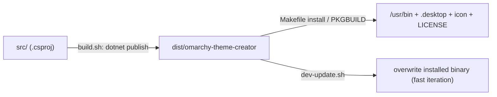

# 13 — Build & Packaging

> The `.csproj` settings, how the single self-contained binary is produced, and the packaging
> targets (AUR, Makefile, dev-update).

Related: [[Home]] · [[01-Overview]] · [[02-Bootstrap-and-Composition-Root]]

## Everyday commands

```bash
# Build (Debug)
dotnet build src/OmarchyThemeCreator/OmarchyThemeCreator.csproj

# Run
dotnet run --project src/OmarchyThemeCreator/OmarchyThemeCreator.csproj

# Publish the single self-contained binary → dist/omarchy-theme-creator
bash packaging/build.sh
```

There is **no test suite**. After code changes, run `dotnet build` and fix compile errors; for UI
changes, a quick `dotnet run` catches runtime XAML/binding errors that compiled cleanly.

## Project settings — `OmarchyThemeCreator.csproj`

```xml
<PropertyGroup>
  <OutputType>WinExe</OutputType>                 <!-- GUI app: no console window -->
  <TargetFramework>net10.0</TargetFramework>
  <Nullable>enable</Nullable>
  <LangVersion>latest</LangVersion>
  <ApplicationManifest>app.manifest</ApplicationManifest>
  <AvaloniaUseCompiledBindingsByDefault>true</AvaloniaUseCompiledBindingsByDefault>
  <AssemblyName>omarchy-theme-creator</AssemblyName>   <!-- binary name -->
  <RootNamespace>OmarchyThemeCreator</RootNamespace>
  <PublishTrimmed>false</PublishTrimmed>          <!-- Avalonia reflects over XAML/bindings -->
  <InvariantGlobalization>true</InvariantGlobalization>
</PropertyGroup>
```

Two settings matter for behavior:

- **`PublishTrimmed=false`** — trimming would strip types Avalonia resolves reflectively for XAML and
  bindings. Leave it off.
- **`AssemblyName` ≠ `RootNamespace`** — the binary is `omarchy-theme-creator` but code namespaces
  under `OmarchyThemeCreator`. (See [[01-Overview]].)

### NuGet dependencies

| Package | Version | Role |
|---|---|---|
| `Avalonia` | 11.2.3 | Core XAML UI |
| `Avalonia.Desktop` | 11.2.3 | X11/Wayland desktop backend |
| `Avalonia.Themes.Fluent` | 11.2.3 | Fluent theme (light/dark) |
| `Avalonia.Fonts.Inter` | 11.2.3 | Bundled Inter font |
| `Avalonia.Controls.ColorPicker` | 11.2.3 | `HsvColor` + color primitives used by the picker |
| `CommunityToolkit.Mvvm` | 8.4.0 | Source-generated MVVM ([[04-ViewModels-and-MVVM]]) |
| `Serilog` | 4.4.0 | Logging facade ([[12-Logging-and-Diagnostics]]) |
| `Serilog.Sinks.Console` | 6.1.1 | Terminal sink |
| `Serilog.Sinks.File` | 7.0.0 | Rolling file sink |
| `SkiaSharp` | 2.88.9 | Image decode/quantize/filter/encode |

## Single-file publish — `packaging/build.sh`

```bash
dotnet publish "$PROJECT" \
  -c Release \
  -r "$RID" \                                      # RID defaults to linux-x64
  --self-contained true \                          # bundle the .NET runtime
  -p:PublishSingleFile=true \                      # one executable
  -p:IncludeNativeLibrariesForSelfExtract=true \   # extract SkiaSharp/Avalonia native libs at runtime
  -p:DebugType=none -p:DebugSymbols=false \        # smaller binary
  -o "$OUT_DIR"                                     # defaults to dist/
```

The result is a self-contained `dist/omarchy-theme-creator` that runs on any `linux-x64` box without
a .NET install. `RID` and the output dir are overridable via env var / first arg.

## Packaging flow



### `packaging/Makefile` (local dev/install)

| Target | Effect |
|---|---|
| `make build` | run `build.sh` → `dist/omarchy-theme-creator` |
| `make install` | install to `${PREFIX:-/usr/local}/bin` + `.desktop` + icon (needs `sudo`) |
| `make uninstall` | remove them |
| `make dev` | rebuild and overwrite the installed binary |
| `make clean` | remove `dist/ bin/ obj/` |

### `packaging/PKGBUILD` (AUR)

`pkgname=omarchy-theme-creator`. Runtime `depends` are minimal because the binary is self-contained:
`hicolor-icon-theme fontconfig libx11 libice libsm glibc`. `makedepends`: `dotnet-sdk>=10.0`, `git`.
It runs `RID=linux-x64 bash packaging/build.sh`, then installs the binary to `/usr/bin`, the
`.desktop` entry, an optional icon, and the license.

### `packaging/dev-update.sh`

Fast inner-loop helper (`make dev` calls it): rebuilds via `build.sh`, finds the installed binary on
`PATH` (fallback `/usr/local/bin`), overwrites it (using `sudo` only if needed), refreshes the
`.desktop`/icon if present, and warns if the app is currently running.

### `packaging/omarchy-theme-creator.desktop`

Standard XDG entry (`Exec=omarchy-theme-creator`, `Categories=Utility;Graphics;DesktopSettings;`)
installed into `share/applications/`.
