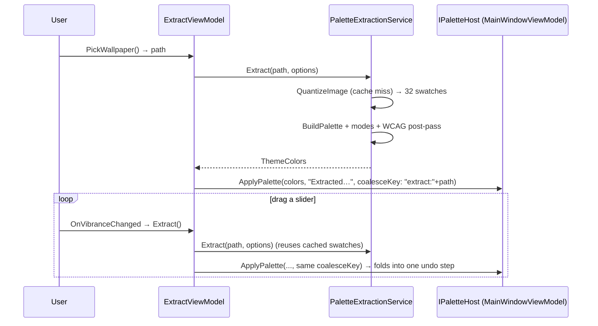
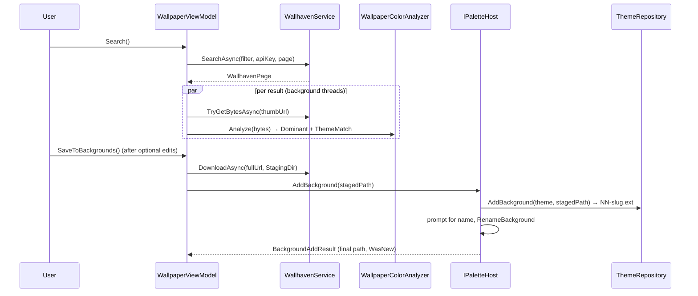
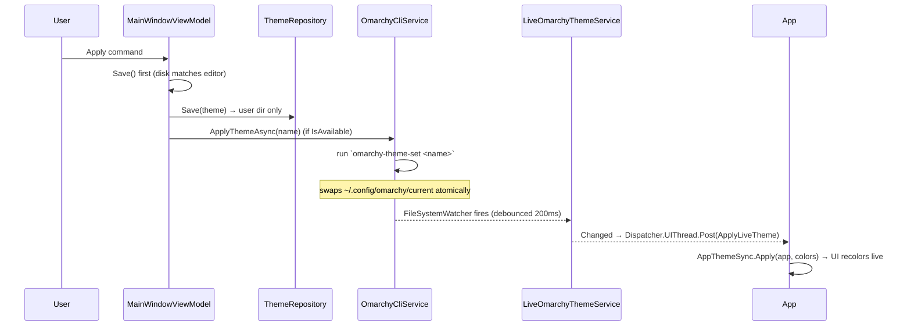

# Data Flows

> End-to-end sequence diagrams for the main user actions, tying the layers together.

Related: [[Home]] · [[06-Palette-Flow-and-IPaletteHost]] · [[07-Palette-Extraction]] · [[08-Wallpaper-Tools]] · [[09-Live-Theming-and-Self-Sync]] · [[10-Theme-Persistence]]

Each flow below crosses View → ViewModel → Service and back. The common spine is
[[06-Palette-Flow-and-IPaletteHost|ApplyPalette]], the single choke point for color changes.

## 1. Edit a single color (color picker)

```mermaid
sequenceDiagram
    participant U as User
    participant W as MainWindow (View)
    participant VM as MainWindowViewModel
    participant D as ColorPickerDialog
    participant CW as ColorWheel + ColorPickerViewModel

    U->>VM: EditColor(field) command
    VM->>W: await PickColorAsync(label, field.Color)
    W->>D: new ColorPickerDialog(...).ShowDialog<Color?>()
    U->>CW: drag ring / SV / type hex
    CW->>CW: Hsv (source of truth) → readouts
    U->>D: OK
    D-->>VM: Color?  (null = cancel → no-op)
    VM->>VM: next = _working.Clone(); next.Set(key, hex)
    VM->>VM: ApplyPalette(next, "Set Accent…")
    Note over VM: push undo · Preview.Update · Contrast.Update · rebuild fields
```

## 2. Extract a palette from a wallpaper



See [[07-Palette-Extraction]] for the pipeline internals and [[06-Palette-Flow-and-IPaletteHost#1. coalesceKey — for programmatic bursts (slider drags)|coalesceKey]] for the undo folding.

## 3. Download a wallhaven wallpaper and add it as a background



The wallpaper lands in the [[Glossary#Staging dir|staging dir]] first; it becomes part of the theme
only via `ThemeRepository`. See [[08-Wallpaper-Tools]] and [[10-Theme-Persistence]].

## 4. Save, then apply to the live desktop



If the CLI isn't installed, the *Apply* button is disabled and only `Save` runs — the editor still
works fully. See [[09-Live-Theming-and-Self-Sync]].
