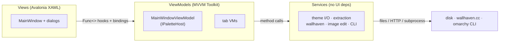

# Omarchy Theme Creator — Developer Docs

> Map-of-content for the codebase. Start here, then follow the `[[wikilinks]]`.

**Omarchy Theme Creator** is a Linux-native GUI (**.NET 10 + Avalonia 11.2**) for authoring
[Omarchy](https://omarchy.org) themes. It ships as a single self-contained `linux-x64` binary
and works as a pure editor even when no `omarchy-*` tools are on `PATH`.

These docs are an [Obsidian](https://obsidian.md) vault: open the `docs/` folder as a vault and
the diagrams (mermaid) and cross-links render natively.

## The 30-second model

Three layers, wired by hand in [[02-Bootstrap-and-Composition-Root|App.axaml.cs]] — there is no
DI container. Every palette change flows through one choke point, the
[[06-Palette-Flow-and-IPaletteHost|IPaletteHost.ApplyPalette]] method.

## Read in order

1. [[01-Overview]] — what it is, the tech stack, the layering rules.
2. [[02-Bootstrap-and-Composition-Root]] — startup, the hand-wired composition root.
3. [[03-Services-Layer]] — the stateless logic layer (index of all services).
4. [[04-ViewModels-and-MVVM]] — MVVM Toolkit patterns and VM ownership.
5. [[05-Views-and-Dialogs]] — XAML views and the `Func<>` hook trick.
6. [[06-Palette-Flow-and-IPaletteHost]] — **the central concept**: the palette choke point + undo/redo.

## Subsystems

- [[07-Palette-Extraction]] — wallpaper → 22-key palette (median-cut + modes + WCAG).
- [[08-Wallpaper-Tools]] — wallhaven search, color analysis, SkiaSharp image editing.
- [[09-Live-Theming-and-Self-Sync]] — the app recolors itself to match the live desktop theme.
- [[10-Theme-Persistence]] — on-disk theme layout, `ThemeRepository`, `colors.toml` I/O.
- [[11-Color-Picker-and-ColorWheel]] — the custom HSV color wheel control.
- [[12-Logging-and-Diagnostics]] — Serilog setup and crash handling.
- [[13-Build-and-Packaging]] — single-file publish, AUR/Makefile packaging.

## Reference

- [[Data-Flows]] — end-to-end sequence diagrams for the main user actions.
- [[Glossary]] — terms used throughout (palette, ANSI, Base16, coalesceKey, staging dir…).

## Ground rules (also in `CLAUDE.md`)

- New logic goes in `Services/` (no Avalonia dependencies there).
- Never mutate the palette around [[06-Palette-Flow-and-IPaletteHost|ApplyPalette]].
- Services must **degrade gracefully** when Omarchy isn't installed.
- Only ever write to the user theme dir; the system theme dir is read-only. See [[10-Theme-Persistence]].
